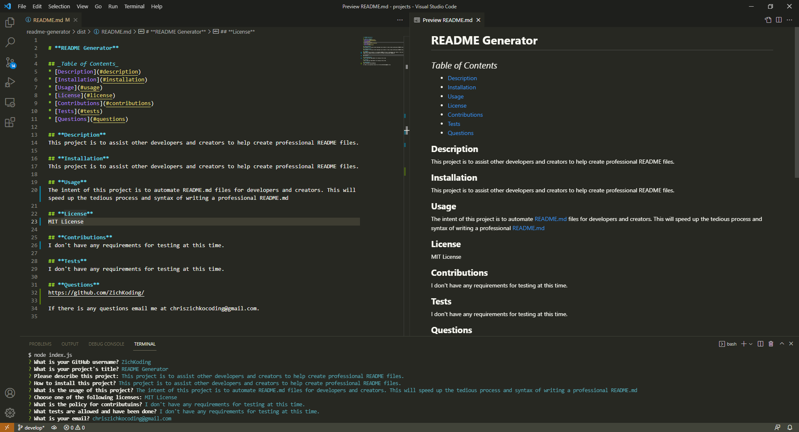

# **README Generator**

## _Table of Contents_
* [Description](#description)
* [Installation](#installation)
* [Usage](#usage)
* [Questions](#questions)

## **Description**
This project is to assist other developers and creators to help create professional README files.

## **Installation**
Currently, the only way to install is to download off of GitHub.

## **Usage**
The intent of this project is to automate README.md files for developers and creators. This will speed up the tedious process and syntax of writing a professional README.md

## **Questions**
https://github.com/ZichKoding/

If there is any questions email me at chriszichkocoding@gmail.com.